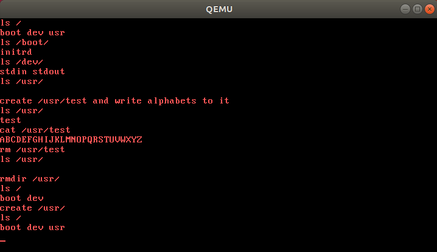
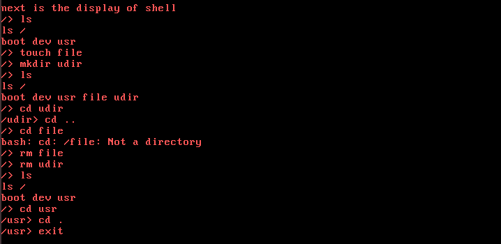

# 
南京大学本科生实验报告

课程名称： **操作系统**

|   学院    | 计算机科学与技术  |          |        |
| :-------: | :---------------: | :------: | :----: |
| **学号**  |     191220029     | **姓名** | 傅小龙 |
| **Email** | 1830970417@qq.com |          |        |

## 1.实验名称

Lab5-文件系统

## 2.实验进度

我完成了：

1.2. 内核支持文件读写

1.3. 用户程序

并通过了用户程序中的测试。

1.4 Shell 中部分指令的实现

## 3. 实验结果

用户程序测试：

shell：

## 4.代码修改处

`lib\syscall.c` 填写`open`, `write` ,`read`, `lseek`, `close`的系统调用，添加`ls`的系统调用。

`kernel\kernel\irqHandle.c`：

​	填写`syscallRead(...)`, `syscallWrite(..)`中对文件操作的情况

​	完成`syscallOpen(...)`, `syscallReadFile(...)`, `syscallWriteFile(...)`, `syscallLseek(...)`, `syscallClose(...)`, `syscallRemove(...)`, 添加`syscallLs(...)`及相关宏定义：`SYS_LS`及其调用.

`app/main.c`:

​	完成`ls(...)`,`cat(...)`函数

​	在`main()`函数中添加shell的逻辑

​	添加shell的部分指令的简单实现：`ls`, `cat`, `cd`, `touch`, `mkdir`, `rm`

## 5. 实验心得

​	本次实验实现了一个简易的文件系统，加深了对操作系统文件管理的认识，对文件信息的数据结构有了一个更加具体的了解。

